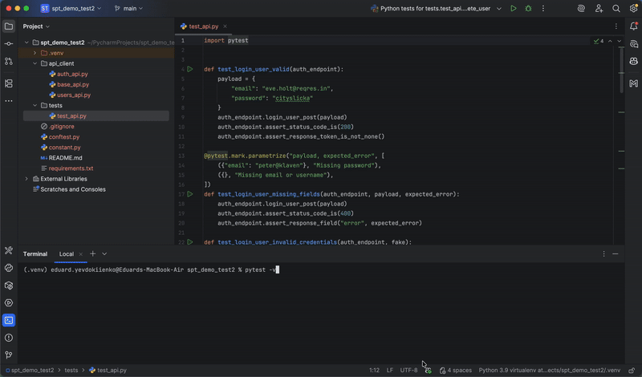

This is a small API testing project for the public ReqRes API (https://reqres.in).
Below you can see a small GIF showing how tests run locally:

What the tests validate
•	status codes (200, 201, 400, 404, 204)
•	response fields like token, id, createdAt, updatedAt
•	that the API returns back the data I send (payload check)
•	error messages in negative cases
•	response structure (data.id, list of users, email contains “@”)

Test cases table
| Test Case ID | Description                          | Method | Endpoint    |    Expected Status | Expected Response Fields                |
|--------------|--------------------------------------|--------|-------------|--------------------|-----------------------------------------|
| TC001        | Get list of users                    | GET    | /api/users  | 200                | data (array), page, per_page, total |
| TC002        | Get single user                     | GET    | /api/users/2| 200                | data.id, data.email, data.first_name, data.last_name |
| TC003        | Get single user not found            | GET    | /api/users/23| 404               | {}                                      |
| TC004        | Create new user                     | POST   | /api/users  | 201                | id, createdAt                           |
| TC005        | Update user                        | PUT    | /api/users/2| 200                | updatedAt                               |
| TC006        | Delete user                        | DELETE | /api/users/2| 204               | (no content)                            |
| TC007        | Login successful                     | POST   | /api/login  | 200                | token                                   |
| TC008        | Login unsuccessful                   | POST   | /api/login  | 400               | error                                   |

Why these validations
•	Status codes must always match the API contract.
•	Important fields like id, token, createdAt, updatedAt must be present.
•	Negative tests show how the API handles invalid data.
•	Parametrize helps reduce duplicate code.
•	Faker is used to generate simple random test data.
